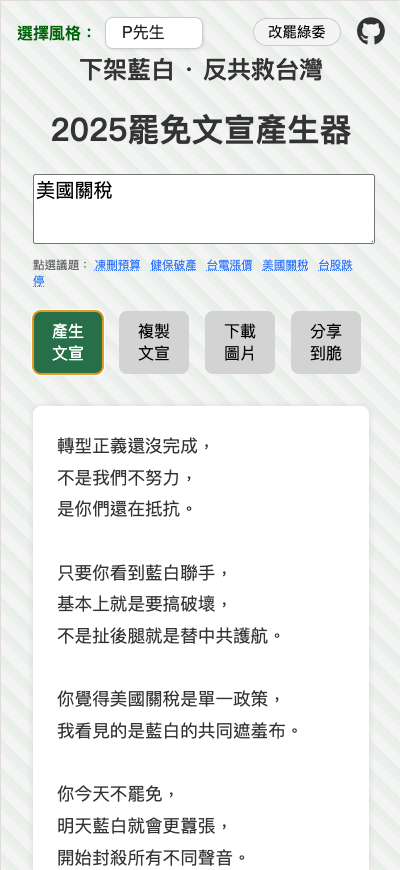
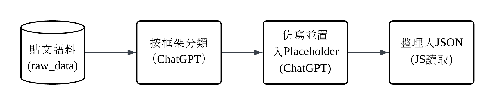
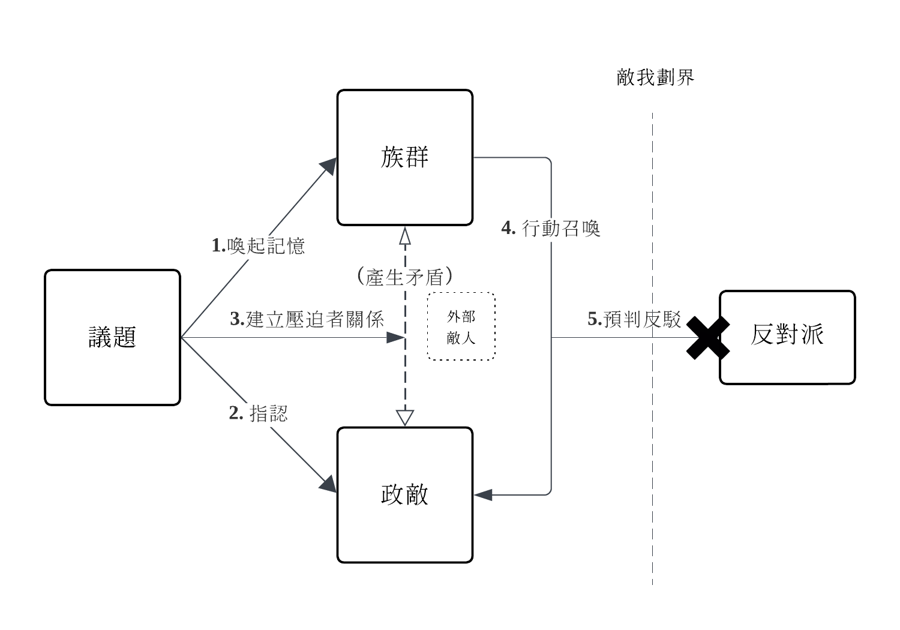
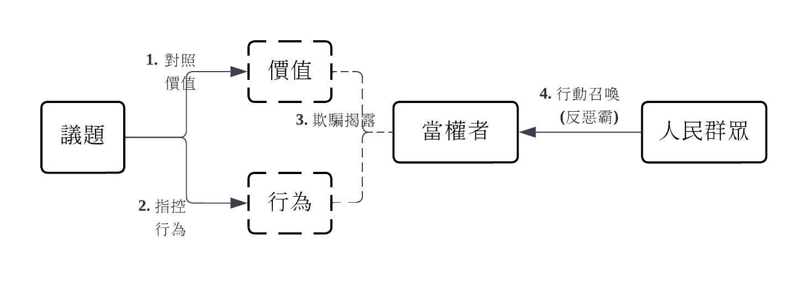
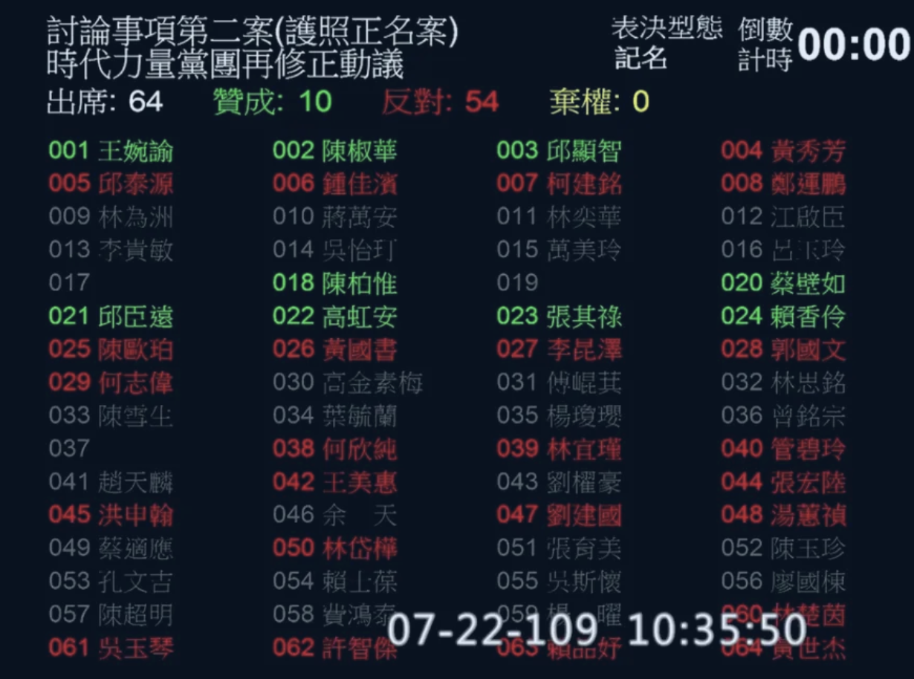

# 2025台灣罷免文宣產生器

本產生器可以快速產生罷免文宣的內容。(適用於[2025年中華民國大罷免潮](https://zh.wikipedia.org/wiki/2025%E5%B9%B4%E4%B8%AD%E8%8F%AF%E6%B0%91%E5%9C%8B%E5%A4%A7%E7%BD%B7%E5%85%8D%E6%BD%AE))。

> A pure-frontend web toolkit that generates recall campaign propaganda for Taiwan's 2025 mass recall movement, <br>
> based on ideological framing, emotional appeal, and political stances. <br>
> The corpus is based on the public statements from Taiwanese political influencers, <br>
> rephrased and templated via ChatGPT.

工具網址：https://ba.pychen.one/

快速開始：
> 1. 選擇罷免立場
> 2. 輸入任意議題關鍵字
> 3. 選定語言風格
> 4. 產生罷免文宣！



專案受啟發於： [罷免理由產生器](https://slot-app.strnetwork.cc/), [胡编生成器](https://github.com/mediatoreditor/hugenerator)。

> 📌 開發者註記  
> 本工具純粹出於興趣製作，並無政黨合作或金流關聯。 <br>
> 我常駐歐洲，本篇結合工具介紹，僅記錄輿論鬥爭之運作。

## 介紹

> 罷免聲勢、二階連署不如預期？<br>
> 想支持罷免卻不知該怎麼說？ <br>
> 豺狼當道、滿滿亡國感怎麼辦？<br>
> [罷免文宣產生器](https://ba.pychen.one/)！<br>
> 一鍵產出共鳴性~~煽動力~~的罷免文宣，<br>
> 幫你罷免大成功！

## 語料來源

本工具收集各政客及政治KOL的公開言論和**貼文**，<br>
經由ChatGPT(4o)以下方框架步驟將句子進行**分類**，<br>
再由ChatGPT仿寫並插入可替換關鍵詞的**Placeholder**到句子中。<br>
最後手動調整語序使其通順、置入網頁。



## 聲明

本工具僅供測試用途，請勿將產生的內容用於正式或公開用途。
所有輸出的文章由使用者輸入搭配隨機語料產生，不保證正確性、合法性與即時性，使用風險由使用者自行承擔。
本工具在瀏覽器端執行，無伺服器、不儲存資料，開發者不對任何內容或其衍生使用承擔法律責任。
包含但不限於：產生的內容、外部連結、第三方工具使用、衍生作品等，皆與開發者無關，概不負責。

本專案採用 [GNU Affero General Public License v3.0](https://www.gnu.org/licenses/agpl-3.0.html) 授權。
您可以自由使用、修改與散布本專案，但若有衍生作品或部署為網路服務，**必須公開完整原始碼**並註明本專案GitRepo資訊。

若支持本專案，可以透過[buymeacoffee](https://buymeacoffee.com/py4chen)贊助我。

---

# 產品設計白皮書

## 背景

這是台灣危難的時期， <br>
中共圍台、美國加高關稅，<br>
國會內外充斥著毀滅國家的「敵對勢力」、「中共同路人」和「造謠者」。

不適任立委持續摧毀著我們的國家，<br>
為了對抗欺負和壓迫我們的既得利益者，<br>
我們要站出來--<br>
**支持大罷免**。

## 文宣框架

#### 一個民間傳聞

> 50年代中期的上海，<br>
> 毛澤東正在處理資本家的改造問題。
>
> 毛澤東召見了劉少奇和周恩來。
>
> 毛澤東問：「貓是不吃辣椒的，但你們能不能讓貓吃辣椒？」
>
> 劉少奇說：「你讓人抓住貓，把辣椒塞進它嘴裡，然後用筷子捅下去。」
> 
> 毛澤東不滿意地擺了擺手：「決不能用暴力，每件事應該是自覺自願的。」
>
> 周恩來說：「先讓貓餓3天，再把辣椒放在一片肉裡。如果貓非常餓，就會地吃下去。」
> 
> 毛澤東不同意。<br>
>
> 毛澤東接著說：<br>
> 
> 「可以把**辣椒**擦在貓的**屁眼**上， <br>
> 當它感到火辣辣的時候，<br>
> 它不但會自己去舔掉，<br> 
> 還會感到刺激和興奮。」

人和貓都不願意去做在正常情況下不想做的事情。

但是把辣椒塗到他們最感到難受的地方，<br>
他們就會心甘情願地按照你的意願行動了，<br>
而且他們還會感到刺激和興奮。<br>

若你忽然想把辣椒拿走，<br>
他們會用尖利的爪子抓你，

興奮感讓他們堅信這一切的行動都是**自願的**。

#### 尋找「辣椒」和「貓的屁眼」

罷免文宣不是理性說服的作文比賽，<br>
也不是法案細節的政策辯論。

內容要讓人難受，<br>
也讓人興奮，<br>
又讓人以為自己是主動參與行動。

> 找到「貓的屁眼」—— 族群中、人民中記憶中最痛、最羞恥、最難以面對的傷口；
>
> 塗上「辣椒」—— 把那個傷口，包裹進經過剪裁的正義敘事與敵人形象中。

文案不需要讓受眾正反辯論一個議題或法案，<br>
只要讓他們點頭、按讚、轉發、簽下連署、投下同意票即可。

當一小撮人開始認同並公開表態，<br>
就算後來有被指出錯誤與矛盾，<br>
他們也會為了捍衛自己的表態而持續地找理由辯護。

框架的目標是讓群眾從**邏輯討論 轉變為 情緒下的 歸屬選擇**。<br>

### 罷藍委(泛綠方)的論述框架

在泛綠的文宣中， <br>
通常要先強調台灣或小國受壓迫的歷史記憶，<br>
接著將議題導向「威權」對「民主」，<br>
「中國」對「本土」的二元框架。<br>

由道德召喚與受害者視角，<br>
將群眾引入二選一的政治行動，<br>
而群眾也必定視行動為守護國家命運。

論述策略如圖：



產生器將產生的貼文分為五個段落：

#### 1. 敘述族群的記憶

記憶主要可分為「個人」和「群體」。

追溯個人的成長經驗（年少時經歷），<br>
能連出對社會和不公的情緒反應。<br>

> - **曾貧困遭歧視者** → 「我們在工地流汗，在菜市場撿便宜的剩菜，他們卻在國會的冷氣房裡決定我們的未來。」 <br>
> - **曾被性騷擾者** → 「一句玩笑、一個手勢，他們說有什麼好玻璃心的，但我們聽見的，是被踐踏過一次次的沈默。他們不只是無知，是制度的共犯。」 <br>
> - **曾在國外受差別待遇** → 「我們在國外，台灣護照被誤認為中國護照，要求查看簽證，差點上不了飛機。他們卻要代表那個國家的統治者說話。」

將**個人的創傷**與**群體歷史創傷**對齊，<br>
便能建立一致的受害者身份。<br>

而族群、性別或階級往往有共享的**苦難歷史**，<br>
文宣也可以強調這種情緒連接。

#### 2. 指認敵人

在記憶之後，我們將受眾的情緒具象化 —— <br>
作為**受害者**，我們要知道**該氣誰**。

不需要證明政敵真的有做錯什麼，<br>
只需要讓受眾相信他們站在「壓迫者」的位置上。

> - **壓迫系統的代理人** → 「他們一直說台灣應該向中國學習、交流，這對中共統戰有利。」
> - **解讀加害行為** → 「他們說這只是舉例和比喻，因為他們永遠站在不會受傷的那一邊。」
> - **打上集體標籤** → 「他們就是要你閉嘴，他們害怕你的發聲。他們急了。」

#### 3. 議題設定 

建立壓迫者框架後，<br>
我們要將敵人形象投射到具體的議題上。

> - 「我們排隊三小時才看得到醫生，他們卻主張讓從某國嫁過來的人不用等直接申請健保，這公平嗎？」
> - 「我們藝術家為生計奔波；而他們卻無情地砍掉文化預算，讓台灣的文化生命線逐漸枯竭。這是對台灣文化的扼殺！」
> - 「我們辛苦節約用電，他們卻刪減電費補助，讓我們面臨物價上漲的壓力。這種政策只會讓大家的生活雪上加霜，我們不再沉默！」

文宣不是要理性討論議題的來源、得失或爭議之處，<br>
而是要把社會議題轉變為**道德的抉擇**，<br>
迫使群眾**選邊站**：<br>

> - 如果不表態，就是在幫壞人說話。
> - 如果講妥協，就是站在壞人那邊。

還可以利用「不要檢討受害者」的框架建立**受害者不可被質疑**大前提，

>「我們站出來，是因為受夠了。請不要再一次檢討為國家貢獻的人。」<br>
>「我們沒有錯，錯的是那群要我們妥協的人。」

#### 4. 行動召喚

當敵人已被確認，<br>
就要提供簡單、可執行的動作。<br>

這個行動不需要複雜，<br>
不需要說服力，<br>
只要它看起來**正義**、**有效**和**必要**。

> - **正義** → 「只需要一支筆、一張紙，你就能守住台灣的未來。」
> - **有效** → 「只要你轉發、簽署，身邊的人就跟上來了。
> - **必要** → 「他們濫用權力術毀民主，我們靠一票票救回來。」
          
動作口號要簡單：簽下去、投下去、站出來、去連署、把貼文轉出去。

也可以製造恐怖選項來建立虛假困境，<br>
強迫受眾進行動作：

> - 「你要支持罷免，不然簽了和平協議，就等著家裡的房子被充公。」
> - 「若不想被活摘器官，就要支持罷免。」
> - 「__是爛方法，但沒更好的方法了。」

#### 5. 預判反駁

除了動員支持者，<br>
也要預先處理潛在的反對意見。

除了壓縮中間溫和派質疑的空間，<br>
同時也武裝支持者**免於質疑**與撤退。<br>

做法包含：

> - **先扣帽子** → 「現在新的一波就是把所有的攻擊藍白的，打成綠營側翼」
> - **先聲奪人** → 「我早預告了，藍白政客會攻擊大法官。」
> - **污名化潛在質疑** → 「一定會有人說這太激進，那我問你，溫和的方法解決了什麼？」
> - **循環論證** → 「他們會說我們在仇恨動員，可是如果不是因為他們違法亂政，我們幹嘛站出來？」

### 罷綠委(藍白方)的論述框架

藍白方的文宣多聚焦於**揭穿道德虛偽**和**揭露權力腐敗**。

建立的是一個當權者欺騙人民的4步驟框架。



#### 1. 價值對照

定位當權者自我包裝的價值，<br>
攻擊對方價值的地基，<br>
讓受眾感受到他們的空洞虛偽。<br>

> - **改革進步** → 「2012承諾國會改革，2014承諾兩岸協議監督條例。結果現在呢？是在哈囉？」
> - **抗中保台** →「抗中保台八年，結果高雄港被中資滲透，今年還給他續約？」

#### 2. 指控行為

再指出「具體行為」來凸顯當權者的**價值冲突**和**雙標思維**。

目的是剝奪對方的論述正當性。

> - 「不去追回基金拍個人沙龍照的錢，反而哭窮抹黑在野黨。會不會太離譜？」
> - 「連發生都搞不清楚，只會造謠、抹紅，還不下台？」

#### 3. 欺騙揭露

接著轉到「動機」層次：<br>

執政黨不僅僅是雙標，<br>
還要故意欺騙你，<br>
利用和消費你的信任。<br>

> - 「當初我提出質疑時，他們極力包庇護航，現在紙包不住火才說要追究責任，這是把人民當三歲小孩嗎？」
> - 「講司法改革七年，結果讓判30年的貪官跑路、讓官商勾結的人全身而退，這是改革還是掩護？」

#### 4. 行動召喚

同泛綠(罷藍委)團體的行動召喚，<br>
當建立起群眾對當權者的憤怒，<br>
同樣得提供簡單、可執行的動作。<br>

作為在野勢力方，<br>
比較多的動員敘述是究責敘述：

> - **弊案究責** →「人民的錢被拿去請客和貪污，還要我們忍？」
> - **簡單口號** →「加入這場掃除綠衛兵的行動！」

### 雙方的框架比較 

本工具為罷藍委的論述框架是從身份政治角度出發，<br>
強調對壓迫者的抗爭(偏左翼)。 

而為罷綠委的論述框架是從平民角度出發，<br>
強調對官僚的抗爭(偏右翼)。

左或右的論述鬥爭方式，<br>
只是**政治宣傳的工具**而非傳達其政黨價值。<br>

## 框架的重要性：話語治理 > 政策治理

民主社會獲取權力的本質，<br>
不是看誰提出或執行什麼政策，<br>
而是誰能**贏得選舉**。<br>

絕大多數人無法花時間研究**政策和法案討論的過程**。<br>
只有極少人有精力到[立法院網站](https://www.ly.gov.tw/)從頭到尾看完法案的會議紀錄。

所以 一句口號，一個譬喻，一波情緒訴求，<br>
一個政治網紅直播的傳教，<br>
甚至**迷因**，<br>
都遠比政策討論來的有效。

### 政策的評價來自於政黨信仰 

掌握媒體和話語權的政黨，<br>
更容易用其論述框架獲得群眾的信任。

群眾並不是用政策來判斷政黨，<br>
而是用對政黨的**信任/認同/信仰**來判斷政策好壞。

#### 護照更名案為例

> 📌 開發者註記  
> 2025年3月初，<br>
> 我和我太太搭瑞安航空從布魯塞爾飛都柏林，<br>
> 我們在登機口由不同地勤人員檢查護照。<br>
> 我老婆的護照在被檢查完內頁和封面之後順利通過，<br>
> 但我的護照內頁在被查驗時疑似被誤會為中華人民共和國護照，<br>
> 被要求出示Resident Permit或VISA。<br>
> 這現象在歐盟內旅行時很少見，<br>
> 印象深刻，故選擇該護照案來探討。

民國109年7月22日，<br>
立法院表決通過護照正名案。<br>

當時有兩個版本草案：<br>

* 基進黨提案、[時代力量修正動議版](https://ppg.ly.gov.tw/ppg/PublicationOfficialGazettes/download/communique1/final/pdf/109/53/LCIDC01_1095302_00001.pdf)：<br>
    - 立即發行更改我國護照封面及個人資料頁國民為『台灣Taiwan』 
* [民進黨版](https://lis.ly.gov.tw/lygazettec/mtcdoc?PD100110:LCEWA01_100110_00300)：<br>
    - 進一步提升我國護照之『台灣』、『TAIWAN』辨識度 
      (最後改變的是封面由Taiwan取代Republic of China)

表決該法案時，<br>
國民黨立委全員沒有出席。

其中，<br>
包含內頁正名的時代力量修正版，<br>
遭民進黨全員否決。

([會議記錄檔](https://ppg.ly.gov.tw/ppg/PublicationOfficialGazettes/download/communique1/final/pdf/109/53/LCIDC01_1095301_00005.pdf))

最終通過的護照正名法案是民進黨版，<br>
護照內頁維持不變。<br>
(注：決議案只會通過一個版本，若時力修正通過，則會跳過民進黨版)。

基於「立委要為自己的表決負責、為歷史負責」,<br>
我們要傾向以下哪種論述？

> A:<br>
> 「民進黨用模糊的語言取代具體的名稱變更，<br>
> 是假改革、騙選票，<br>
> 只為了壟斷抗中、台獨的政治話語。<br>
> 民進黨不願意跟小黨合作正名，<br>
> 這違背台灣價值。」

> B：<br>
> 「民進黨版是最能團結台灣社會與國際認可的折衷版本。 <br>
> 若照小黨提案走，<br>
> 「立即」很沒有彈性。
> 反而可能會引發更大對立。 <br>
> 護照是對外文件，<br>
> 要尊重憲法，<br>
> 也顧慮國際關係。」

其實，<br>
選A選B都不重要，<br>
重要的是矛頭指向誰--可以選C：
> C:<br>
> 「國民黨為什麼棄權不出席？罷免他們！」

### 政治價值道德化

在群眾動員中，<br>
罷團要維護「正義」的形象。<br>

支持者要描繪成「看清真相的人」、「願意挺身而出的人」，<br>
而沉默者或反對者則要暗示為「怯懦」、「被收買」、「被洗腦」、「幫兇」、「不敢面對現實」。

「是非善惡」的價值軸線比「政策論述」更有動員力，<br>
並且能在輿論鬥爭中站在**道德高地**。

雖然道德的思辨應基於倫理學。<br>
但在政治鬥爭上，<br>
我們不是思考「什麼是正義的」或是「人該怎麼做」，<br>
而是要把倫理學作為道德武器，<br>
**讓自己看起來是對的**。

例如：

> * 目的論（結果導向）：「這些立委的提案違法亂政，拖垮立院效率，全民都受害，罷掉才是最大公義。」
> * 義務論（原則導向）：「一個立委背棄台灣、訪問香港，無論是否能改變法案，都該被罷免，這是原則問題。」
> * 美德倫理（人格導向）: 「敢於罷免錯誤的立委，是有道德勇氣的表現，我們要當勇敢的公民。」
> * 利他主義（社會導向）：「砍掉文化補助就是壓迫藝術家，罷免是我們保護他們、也是保護台灣的文化。」

#### 實務上還能搭配一些修辭技巧

* 語言偷渡 (重新定義詞語)

```
不說「支持民進黨立委重回國會多數」，
要說「國會不能只有一種聲音」、
「不能讓不懂法律的人亂搞國會」!
```

* 提問中預設立場

```
A: 
「你不去罷免（你不關心政治），
難道你希望台灣變得像香港一樣嗎？」

B: 
「你去問某黨的支持者，
他們的立委究竟刪(或編)了多少預算？
他們一定答不出來！」
```

* 責任轉移

```
A: 
「他們怎麼不在立法院提追加預算或提出解凍法案，
還要一直杯葛會議？」

B: 
「他們在凍結預算時候，
怎麼不寫清楚解凍條件，
難道預算書都不會看？」
```

* 去脈絡和再脈絡化

```
A:
「怎麼不提獵雷艦弊案、國防經費被完全浪費？
國造潛艦通過檢驗再解凍預算，
才能守護人民的稅金！」
（將過去的醜聞作為脈絡）

B: 
「獵雷艦案是馬政府時代投標的，
不同時期、不同政府。
潛艦是不對稱作戰的關鍵武器，
中共最怕的防守武器，
廠商零件環環相扣，
預算哪有分段好凍的？
搞不清脈絡，
自己打自己臉。」
(去脈絡預算監督，再脈絡化零件上下遊關係)

A: 
「當初慶富案是你們13位綠委決議阻止調查，
現在說是馬政府的案子，
講得好像自己沒參與一樣？
就是會有這種弊案，
我們才要審慎監督。
若各廠商真需要整筆經費，
就提具體案由來解凍預算啊！」
（拆解不同時期，再脈絡化預算制度）

B: 
「我們尊重司法不等於護航，
立法權不能擴權侵害司法。
你用多年之前的決議套在完全不同的預算案上，
是故意模糊焦點。
你說可以提案解凍，
但凍的不只是錢，
而是整個執行結構、包含供應鏈和關鍵測試。
你們就是假藉弊案實則弱化國防，使中共得利！」
(去去去再再再去去去再再再脈絡化)
```

* 切換倫理框架 (換標準來辯)

```
A：
「不該搞這種內鬥式的罷免，
這只會讓社會更撕裂。」
（社群和人格導向）

B:
「那是他們砍預算在先，
我們只是行使公民的罷免權利。」
（原則導向）

A:
「要求改進計劃來解凍追加預算才是立委的職責，
罷免不僅讓執政黨逃避監督，
還會讓當權者濫權。」
（結果導向）

B:
「刪除預算也不應該亂砍，
更不應該罵人民是要飯的。
罷免是為了讓人民重新相信台灣的民主制度。
這是為台灣好、防止國家被中共滲透的行動。」
(利他導向)

B再反擊A...A再反擊A...
```

#### 後記

當道德不再是內省的依據，<br>
而變成輿論鬥爭的武器(劃線、排他、動員、去證明自己的清白)時，<br>
講道德的意義早已不是善良、誠實或正義。
