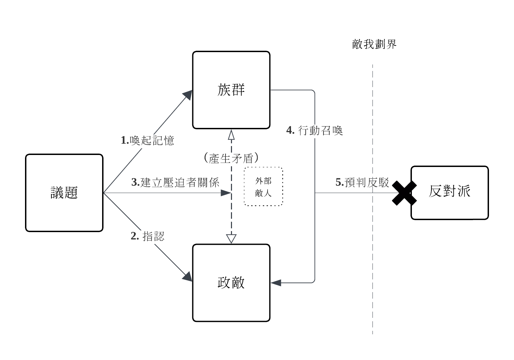

# 罷免文宣產生器

本產生器可以幫助你產生罷免文宣的內容。

適用於[2025年中華民國大罷免潮](https://zh.wikipedia.org/wiki/2025%E5%B9%B4%E4%B8%AD%E8%8F%AF%E6%B0%91%E5%9C%8B%E5%A4%A7%E7%BD%B7%E5%85%8D%E6%BD%AE)。

只要選定罷免立場，
輸入任何議題關鍵字，
選定語言風格，
即能快速產生罷免文宣內容。

https://ba.pychen.one/

[//]: # (圖片)

專案受啟發於： [罷免理由產生器](https://slot-app.strnetwork.cc/), [胡编生成器](https://github.com/mediatoreditor/hugenerator)。

## 介紹

在中共圍台、美國加高關稅的危難時期，  
國會充斥著毀滅國家的「敵對勢力」、「中共同路人」和「造謠人」。

不適任立委持續摧毀著我們的國家，
為了對抗欺負和壓迫我們的既得利益者，
愛台灣的我們站出來-- 
**支持大罷免**。

二階罷免連署、罷免聲勢不如預期？

支持罷免卻不知該怎麼說？

罷免文宣缺少說服力？

你需要**罷免文宣產生器**！

本工具收集各類大罷免貼文的語料，
只要你輸入幾個關鍵字，
就能組合出富有共鳴性~~煽動力~~的罷免文宣，
幫助你大罷免大成宮。

## 文宣的產生邏輯 

#### 中國民間傳聞

50年代中期的上海，毛澤東正在處理對民族資本家的社會主義改造問題。

毛澤東召見了劉少奇和周恩來。

毛澤東問：「貓是不吃辣椒的，但你們能不能讓貓吃辣椒？」

劉少奇說：「你讓人抓住貓，把辣椒塞進它嘴裡，然後用筷子捅下去。」

毛澤東不滿意地擺了擺手：「決不能用暴力，每件事應該是自覺自願的。」

周恩來說：「先讓貓餓3天，然後，我把辣椒裹在一片肉裡。如果貓非常餓的話，就會囫圇吞棗般地吃下去。」

毛澤東也不同意，因為在他看來，不能用欺騙手段愚弄人。

毛澤東說：「可以把辣椒擦在貓的屁眼上，當它感到火辣辣的時候，它不但會自己去舔掉，還會感到刺激和興奮。」

聽毛這麼一說，三人都哈哈大笑。

#### 貓和人又有什麼差別呢？

在毛澤東看來，
人和貓沒有差別，
他們都不願意去做在正常情況下不想做的事情。

但是你若把辣椒塗到他們最感到難受的地方，
他們就會心甘情願地按照你的意願行動了，
而且他們還會感到刺激和興奮。

若你忽然想把辣椒拿走，
他們會用尖利的爪子抓你，

因為興奮感讓他們堅信這一切的行動都是**自主自願的**。

#### 尋找「辣椒」和「貓的屁眼」

罷免文宣不是理性說服的作文比賽，也不是法案細節的政策辯論。

內容要讓人難受，也讓人興奮，又讓人以為自己是主動參與行動。

我們要找到「貓的屁眼」—— 族群中歷史上最痛、最羞恥、最難以面對的傷口；

然後塗上「辣椒」—— 把那個傷口，包裹進經過剪裁的正義敘事與敵人形象中。

文案不需要讓受眾正反辯論，只要讓他們點頭、按讚、轉發、簽下連署、投下同意票即可。

當一小撮人開始認同並公開表態，就算後來有被指出錯誤與矛盾，他們也會為了捍衛自己的表態而持續地為我方辯護。

### 泛綠方(罷藍白)的論述框架

在泛綠的文宣中， 我們常常可以看到文案先強調台灣或小國的歷史記憶， 
接著將議題導向「威權」壓迫「民主」、「中國」壓迫「本土」的二元框架。 
最後，由道德召喚與受害者視角，將群眾引入政治行動，而群眾也視行動為守護台灣命運。

論述策略如圖：

以此為基礎，我將需產生的貼文分為五個部分：

#### 1. 敘述族群的記憶

記憶可分為「個人」和「群體」

個人對社會和不公的情緒反應，可追溯自成長經驗（尤其年少時的創傷）。 
將**個人的創傷**與**群體歷史創傷**對齊，便能建立一致的受害者身份。 

例如：
- **貧困遭歧視者** → 「我們在工地流汗，在菜市場撿剩菜，他們卻在冷氣房裡決定我們的未來，現在還想動用權力幫財團改法？」  
    (這種論述想在似乎已不常見)
- **曾被性騷擾者** → 「一句玩笑、一個手勢，他們說有什麼好玻璃心的，但我們聽見的，是被踐踏過一次次的沈默。他們不只是無知，是制度的共犯。」  
- **曾在國外受差別待遇** → 「我們在海外，護照被誤認中國而被拒絕登機，他們卻要代表那些那個國家的統治者說話。」

而群體記憶通常建立在族群身份之上，例如族群、性別或階級所共享的歷史經驗。 
歷史經驗可經由教育（學習台灣史）、自媒體或口述進一步內化。

#### 2. 指認敵人

當群體記憶被喚起之後，我們要迅速、明確地指出敵人是誰。

這個步驟的目的是讓受眾將情緒具象化——不是感到不滿，而是知道該氣誰。

在語言策略上，我們不需要證明敵人真的有做錯什麼，只需要讓受眾相信對方站在「壓迫者」的位置上。

常見做法：

把政敵描繪為壓迫系統的代理人（例如：「幫財團修法的立委」、「一直說台灣應該向中國學習的人」）。

認定對方價值觀與我們相反（例如：「他們說那只是玩笑，我們知道那是傷害」）。

模糊具體責任，強化集體標籤（例如：「藍白就是要你閉嘴」、「他們從來不關心你過得怎麼樣」）。

關鍵在於：不只找出一個人，而是打上標籤、連接整個群體。

#### 3. 議題代入

我們在這步驟要將遺體嗲如，確保受眾將怨恨集中於特定政敵。

例如：

- **貧困議題** → 「某產業或群體在剝削你。」 → 敵對政黨某政客曾經在該產業工作或有關聯。
- **低薪失業議題** → 「某國勢力偷走了你的機會。」 → 敵對政黨某政客曾經訪問某國。
- **健保財務壓力** → 「某些族群佔用了你的資源」 → 敵對政黨有或可能接納該族群的代表。

在指認議題的敵人，我們同時要建立「我們沒有錯，錯的是敵人」的敘事。
其中，「不要檢討受害者」可以製造「受害者不可被質疑」的前提，
取消中間的討論空間，強迫大眾二選一。

例如：

「我們站出來，不是因為脆弱，是因為受夠了。請不要再一次檢討受害者。」

「我們沒有錯，錯的是那群看著問題卻選擇沉默的人。」

#### 4. 行動召喚

當情緒被喚起、敵人被確認，我們要立刻提供具體、簡單、可執行的動作，讓人覺得「我現在就可以出一份力」。  這個行動不需要複雜，甚至不需要說服力，只要它看起來「正義」「有用」「立即有效」。

建議動詞用語：簽下去、投下去、站出來、去連署、把這篇文轉出去。

建議語氣：迫切、強烈、毫不遲疑。

例如：

「你只需要一枝筆、一張紙，就能守住台灣的未來。」

「他們靠人海戰術毀民主，我們靠一票票救回來。」

「你不動，誰來幫你出聲？你一動，身邊的人就跟上來了。」

目的是讓支持者把憤怒轉為行動能量，而不是只是「點頭同意」或「內心認同」就結束。

#### 5. 預判反駁

一篇成功的罷免文宣，不只是動員支持者，也要預先處理潛在的反對意見或冷水。  這個步驟的目的是壓縮中間選民的遲疑空間，同時保護支持者免於質疑與撤退。

做法包含：

使用反問句削弱對手立場。

先聲奪人：指稱敵人一定會用「這種招」，但我們早就知道了。

將質疑者預設為無知、自私或共犯，讓讀者不願與其為伍。

例如：

「一定會有人說這太激進，那我問你，溫和的方法解決了什麼？」

「他們會說我們在仇恨動員，可是如果不是因為他們違法亂政，我們幹嘛站出來？」

「一堆人在那邊講法案、講規則，但人民什麼時候在他們眼裡重要過？」

這個段落是整篇文宣的防禦盾牌，沒有它，前面的情緒與行動會很容易被冷水澆熄。

### 罷綠委方的論述框架

## 語料來源

## 專案目的

### 意識形態鬥爭

### 價值道德化

## 須知與免責聲明

本工具僅供測試用途，請勿將產生的內容用於正式或公開用途。
所有輸出的文章由使用者輸入搭配隨機語料產生，不保證正確性、合法性與即時性，使用風險由使用者自行承擔。
本工具在瀏覽器端執行，無伺服器、不儲存資料，開發者不對任何內容或其衍生使用承擔法律責任。
包含但不限於：產生的內容、外部連結、第三方工具使用、衍生作品等，皆與開發者無關，概不負責。
