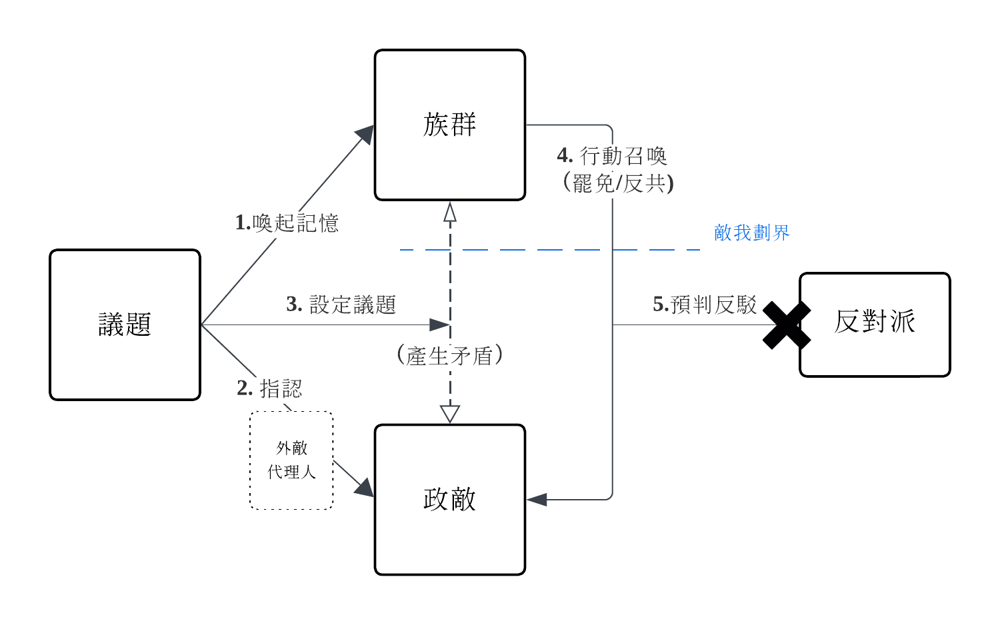

# 罷免文宣產生器

本產生器可以幫助你產生罷免文宣的內容。

適用於[2025年中華民國大罷免潮](https://zh.wikipedia.org/wiki/2025%E5%B9%B4%E4%B8%AD%E8%8F%AF%E6%B0%91%E5%9C%8B%E5%A4%A7%E7%BD%B7%E5%85%8D%E6%BD%AE)。

只要選定罷免立場，
輸入任何議題關鍵字，
選定語言風格，
即能快速產生罷免文宣內容。

https://ba.pychen.one/

[//]: # (圖片)

專案受啟發於： [罷免理由產生器](https://slot-app.strnetwork.cc/), [胡编生成器](https://github.com/mediatoreditor/hugenerator)。

## 介紹

二階罷免連署、罷免聲勢不如預期？ 
支持罷免卻不知該怎麼說？  
罷免文宣缺少說服力？  

你需要**罷免文宣產生器**！

只要輸入關鍵字， 
立即產出有共鳴性~~煽動力~~的罷免文宣，
幫你罷免大成宮！

### 工具背景
在中共圍台、美國加高關稅的危難時期，  
國會充斥著毀滅國家的「敵對勢力」、「中共同路人」和「造謠人」。

不適任立委持續摧毀著我們的國家，
為了對抗欺負和壓迫我們的既得利益者，
愛台灣的我們站出來-- 
**支持大罷免**。

## 文宣的產生框架

#### 中國民間傳聞

50年代中期的上海， 
毛澤東正在處理資本家的改造問題。

毛澤東召見了劉少奇和周恩來。

毛澤東問：「貓是不吃辣椒的，但你們能不能讓貓吃辣椒？」

劉少奇說：「你讓人抓住貓，把辣椒塞進它嘴裡，然後用筷子捅下去。」

毛澤東不滿意地擺了擺手：「決不能用暴力，每件事應該是自覺自願的。」

周恩來說：「先讓貓餓3天，再把辣椒放在一片肉裡。如果貓非常餓，就會地吃下去。」

毛澤東也不同意， 
在他看來， 
不能用欺騙手段愚弄人。

毛澤東說： 

「可以把**辣椒**擦在貓的**屁眼**上，  
當它感到火辣辣的時候， 
它不但會自己去舔掉，  
還會感到刺激和興奮。」

#### 貓和人又有什麼差別呢？

在毛澤東看來， 
人和貓沒有差別， 
他們都不願意去做在正常情況下不想做的事情。

但是你若把辣椒塗到他們最感到難受的地方， 
他們就會心甘情願地按照你的意願行動了， 
而且他們還會感到刺激和興奮。 

若你忽然想把辣椒拿走， 
他們會用尖利的爪子抓你，

因為興奮感讓他們堅信這一切的行動都是**自願的**。

#### 尋找「辣椒」和「貓的屁眼」

罷免文宣不是理性說服的作文比賽， 
也不是法案細節的政策辯論。

內容要讓人難受， 
也讓人興奮， 
又讓人以為自己是主動參與行動。

我們要找到「貓的屁眼」—— 族群中歷史上最痛、最羞恥、最難以面對的傷口；

然後塗上「辣椒」—— 把那個傷口，包裹進經過剪裁的正義敘事與敵人形象中。

文案不需要讓受眾正反辯論， 
只要讓他們點頭、按讚、轉發、簽下連署、投下同意票即可。

當一小撮人開始認同並公開表態， 
就算後來有被指出錯誤與矛盾， 
他們也會為了捍衛自己的表態而持續地找理由辯護。

框架的目標是讓群眾從**邏輯討論轉變為情緒下的歸屬選擇**。 

### 罷藍白(泛綠方)的論述框架

在泛綠的文宣中，  
文案通常先強調台灣或小國受壓迫的歷史記憶， 
接著將議題導向「威權」對「民主」， 
「中國」對「本土」的二元框架。 

由道德召喚與受害者視角， 
將群眾引入二選一的政治行動， 
而群眾也必定視行動為守護國家命運。

俗稱 **抗中保台**。

論述策略如圖：

以此為基礎， 
產生器將產生的貼文分為五個段落：

#### 1. 敘述族群的記憶

記憶主要可分為「個人」和「群體」。

追溯個人的成長經驗（年少時經歷）， 
能連接出對社會和不公的情緒反應。 

將**個人的創傷**與**群體歷史創傷**對齊， 
便能建立一致的受害者身份。 

- **曾貧困遭歧視者** → 「我們在工地流汗，在菜市場撿便宜的剩菜，他們卻在國會的冷氣房裡決定我們的未來。」  
- **曾被性騷擾者** → 「一句玩笑、一個手勢，他們說有什麼好玻璃心的，但我們聽見的，是被踐踏過一次次的沈默。他們不只是無知，是制度的共犯。」  
- **曾在國外受差別待遇** → 「我們在海外，護照被誤認中國而被拒絕登機，他們卻要代表那些那個國家的統治者說話。」

群體記憶通常建立在族群身份之上， 
例如族群、性別或階級所共享的**苦難歷史**。 
我們經常是以**多元**的名義傳播或篩選這段歷史， 
再由自媒體和輿論進一步內化。

#### 2. 指認敵人

喚起記憶之後， 
我們要將受眾的情緒具象化 ——  
我們是受害者，我們要知道該氣誰。

我們不需要證明政敵真的有做錯什麼， 
只需要讓受眾相信他們站在「壓迫者」的位置上。

- **壓迫系統代理人** → 「他們一直說台灣應該向中國學習、交流。」
- **解讀加害行為** → 「他們說這只是舉例和比喻，因為他們永遠站在不會受傷的那一邊。」
- **打上集體標籤** → 「他們就是要你閉嘴，他們害怕你的發聲。他們急了。」

#### 3. 議題代入 道德化 

建立情緒的壓迫者框架後， 
我們要將敵人形象投射到具體的議題上。

- 「我們排隊三小時才看得到醫生，他們卻主張讓從某國嫁過來的人不用等直接申請健保，這公平嗎？」
- 「我們藝術家為生計奔波；而他們卻無情地砍掉文化預算，讓台灣的文化生命線逐漸枯竭。這是對台灣文化的扼殺！」
- 「我們辛苦節約用電，他們卻刪減電費補助，讓我們面臨物價上漲的壓力。這種政策只會讓大家的生活雪上加霜，我們不再沉默！」

我們不是要理性討論議題的來源、得失或爭議之處， 
而是要把社會議題轉變為**道德的抉擇**， 
迫使群眾**選邊站**： 

- 如果不表態，就是在幫壞人說話。
- 如果講妥協，就是站在壞人那邊。

還可以利用「不要檢討受害者」的框架建立「**受害者不可被質疑**」的大前提，

- 「我們站出來，是因為受夠了。請不要再一次檢討為國家貢獻的人。」
- 「我們沒有錯，錯的是那群要我們妥協的人。」

要迫使大眾在道德上2選1。

#### 4. 行動召喚

當政敵已被確認， 
我們就要立刻提供簡單、可執行的動作。 

這個行動不需要複雜， 
不需要說服力， 
只要它看起來**正義**、**有效**和**必要**。

- **正義** → 「只需要一支筆、一張紙，你就能守住台灣的未來。」
- **有效** → 「只要你轉發、簽署，身邊的人就跟上來了。」
- **必要** → 「他們濫用權力術毀民主，我們靠一票票救回來。」
          
用語要簡單且迫切不遲疑： 
簽下去、投下去、站出來、去連署、把貼文轉出去。

也可以製造恐怖選項來建立虛假困境， 
強迫受眾進行動作：

- 「你要麼支持罷免，不然簽了和平協議，就等著家裡的房子被充公。」
- 「若不想被活摘器官，就要支持罷免。」
- 「__是爛方法，但沒更好的方法了。」

#### 5. 預判反駁

除了動員支持者， 
也要預先處理潛在的反對意見。

除了壓縮中間選民的遲疑空間， 
同時也武裝支持者**免於質疑**與撤退。 

做法包含：

- 先扣帽子 → 「現在新的一波就是把所有的攻擊藍白的，打成綠營側翼」
- 先聲奪人 → 「我早預告了，藍白政客會攻擊大法官。」
- 污名化質疑 → 「一定會有人說這太激進，那我問你，溫和的方法解決了什麼？」
- 循環論證 → 「他們會說我們在仇恨動員，可是如果不是因為他們違法亂政，我們幹嘛站出來？」

防禦盾牌阻擋反對派或中間派論述， 
還能保持罷免支持者的情緒。

### 罷綠委(藍白方)的論述框架

藍白方的文宣多聚焦於**揭穿道德虛偽**和**揭露權力腐敗**。

他建立的是一個當權者欺騙人民的框架。

俗稱：**綠能你不能**。

TODO

產生器將產生的貼文分為四個段落：

#### 1. 價值對照

定位當權者自我包裝的價值， 
攻擊對方價值的地基， 
讓受眾感受到這些口號是空洞虛偽的。 

- **改革進步** → 「2012承諾國會改革，2014承諾兩岸協議監督條例。結果現在呢？是在哈囉？」
- **抗中保台** →「抗中保台八年，結果高雄港被中資滲透，今年還給他續約？」

#### 2. 指控行為

接著再指出「具體行為」來凸顯當權者的**價值冲突**和**雙標思維**。

目的不是說服， 
而是剝奪對方的論述正當性。

- 「不去追回基金拍個人沙龍照的錢，反而哭窮抹黑在野黨。會不會太離譜？」
- 「連發生都搞不清楚，只會造謠、抹紅，還不下台？」

#### 3. 欺騙揭露

揭露具體事跡之後， 
我們將論述轉到「動機」層次， 

政敵不僅僅是雙標， 
還要故意欺騙你， 
利用和消費你的信任。 

- **時間序** →「當初我提出質疑時，他們極力包庇護航，現在紙包不住火才說要追究責任，這是把人民當三歲小孩嗎？」
- **** →「講司法改革七年，結果讓判30年的貪官跑路、讓官商勾結的人全身而退，這是改革還是掩護？」

#### 4. 行動召喚

同泛綠(罷藍白)團體的行動召喚， 
當建立起群眾對當權者的憤怒， 
我們也是提供簡單、可執行的動作。 

藍白方作為在野勢力， 
比較多的動員敘述為究責敘述：

- 弊案究責 →「人民的錢被拿去請客和貪污，還要我們忍？」
- 簡單口號 →「加入這場掃除綠衛兵的行動！」

### 雙方的框架比較 

罷藍白方的論述框架主要建立我們他們、壓迫者受害者的對立， 
這是從身份出發對壓迫的抗爭。

罷綠委方的論述框架主要是抨擊當權者的貪污、濫權和雙標， 
建立人民和當權者的對立。 
這是從平民出發對官僚的抗爭。

從論述風格看， 
- 泛綠（罷藍白方）偏左翼， 
- 藍白（罷綠委方）偏右翼。 

左或右的論述鬥爭方式， 
在台灣通常只是**政治宣傳的工具而非其政黨真正的價值**。 

泛綠在網路世代中的**群眾動員力**和**輿論武裝上**更有優勢。 

## 語料來源

## 專案目的

### 意識形態鬥爭

### 價值道德化

### 其他的論述手法

#### 在提問中預設立場

輿論戰中最常見的**轉移舉證責任**是從主張者變成懷疑者， 
避開查證和找尋真相的責任， 
只要質疑就能持續扮演正義的一方。

親執政支持者：「你說預算被刪不能執行，那刪完到底還有多少你自己知道嗎？」
親在野支持者：「你連被砍了多少預算都不知道，還當什麼部長？」

#### 遮蔽部分事實

## 須知與免責聲明

本工具僅供測試用途，請勿將產生的內容用於正式或公開用途。
所有輸出的文章由使用者輸入搭配隨機語料產生，不保證正確性、合法性與即時性，使用風險由使用者自行承擔。
本工具在瀏覽器端執行，無伺服器、不儲存資料，開發者不對任何內容或其衍生使用承擔法律責任。
包含但不限於：產生的內容、外部連結、第三方工具使用、衍生作品等，皆與開發者無關，概不負責。
